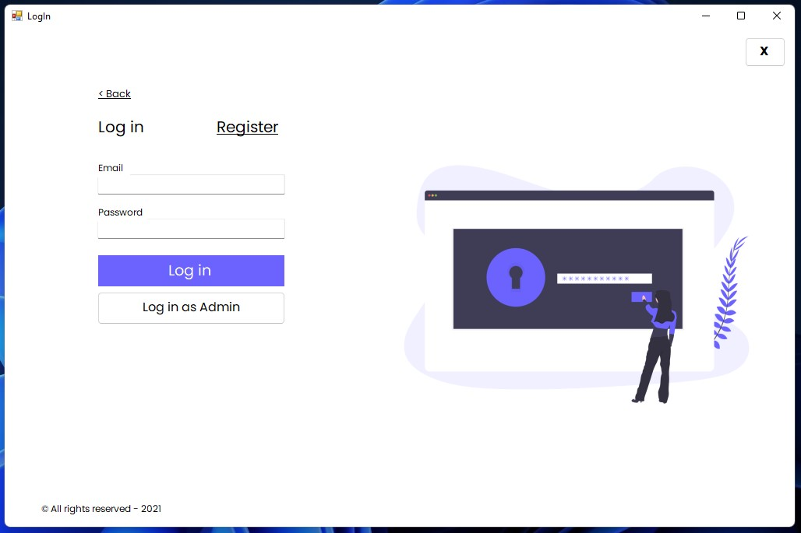
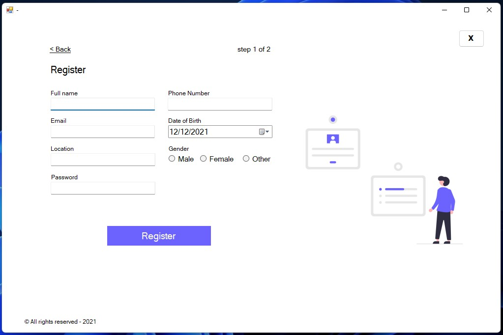
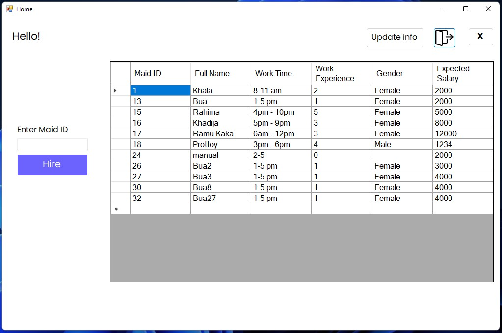
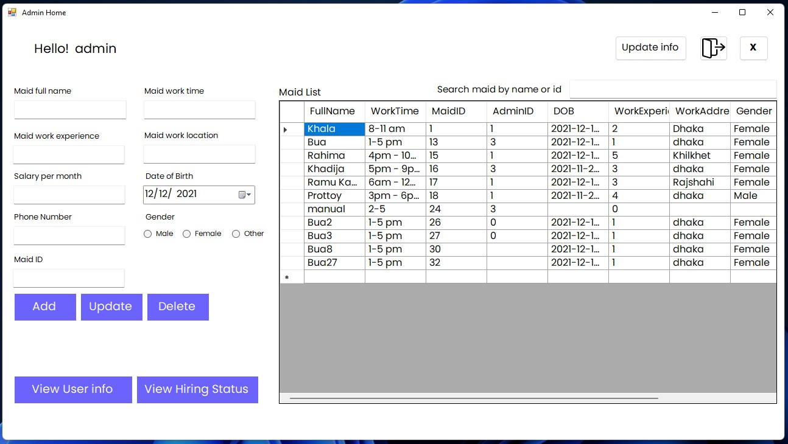

# BuaKoi Maid Service
## _Effortlessly hire maids with BuaKoi - Your one-stop solution for domestic help._

The BuaKoi Maid Service Management System is a professional and reliable solution for managing maid service hiring processes. The system follows a language-independent 3-tier architecture, adhering to Object-Oriented Programming principles. The database is normalized using the 2NF model and utilizes MySQL for efficient CRUD operations.

## Features
- Search and hire maids: Users can easily search and hire maids through the application.
- Admin dashboard: Admin can view hiring status, search, insert, update, and delete maids using a simple and intuitive dashboard.
- CRUD operations: Both users and admin have access to CRUD operations (Create, Read, Update, Delete) for maids, allowing for seamless management and organization of data.

## Tech
- C# programming language
- .NET Framework 4.7.2
- Windows Forms for the UI
- Visual Studio and MSBuild for development and build automation
- MySQL database
- Some other standard .NET libraries and dependencies for handling XML, data access, etc.

## Solution Stack
- Three-tier architecture with language-independent design, utilizing OOP principles at the application layer.
- Normalized database with 2NF schema, providing CRUD functionality for efficient data management.
  

## Screenshots
 

> Log in form for existing users, where they can enter their credentials to access their account and use the application.

> Registration form for new users, allowing them to create an account and gain access to the application's features.

> User Home form, where users can search and hire maids through the application.

> Admin Home form, where administrators can manage the application and view hiring status for maids.

## Supervised by

  Md. Mazid-ul-Haque
  mazid@aiub.edu
  https://www.linkedin.com/in/mdmazidulhaque/

## Developers

  Kanta Bhattacharjee
  kanto.uv@outlook.com
  https://www.linkedin.com/in/kanta-bhattacharjee/

  Partho Sarothi Roy 
  parthoshaon@gmail.com
  https://www.linkedin.com/in/parthoshaon

  Protik Acharjay
  protik7777777@gmail.com
  https://www.linkedin.com/in/protik-acharjay-1750a31a6?originalSubdomain=bd

  Sagar Chandra Modok
  sagar01777034891@gmail.com
